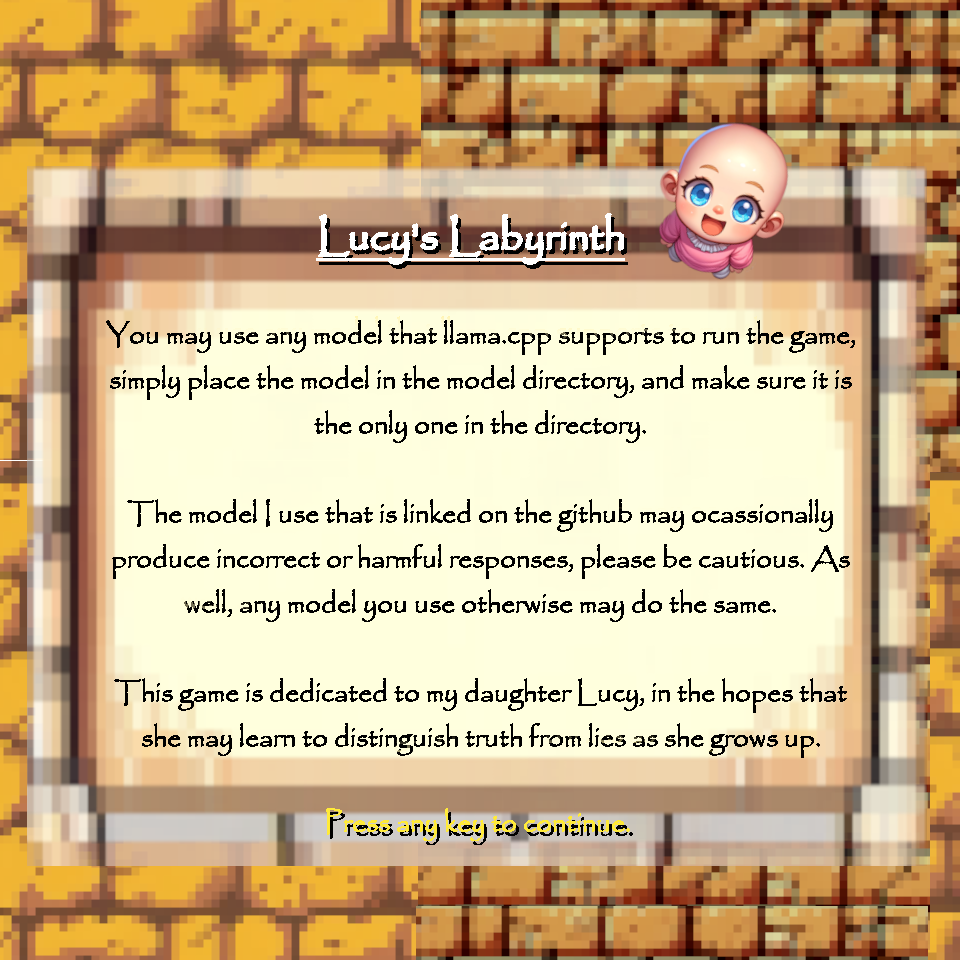

# Lucy's Labyrinth

A game made for a school project, dedicated to my daughter.

## The Game

You play as Lucy, in a labyrinth of truth and lies.

You will encounter doors throughout the labyrinth (with AI for brains), each of which has a profession, and either a preference for lying, or honesty.

You may ask the door any question you can type, and it will answer. Well, only so long as the question relates to their profession (and isn't too easy).

If you can then guess if the door always lies or always tells the truth, it will unlock, and let you through.

If you guess incorrectly, or give up, however, the door will block off forever. Don't give up!

If you can make it all the way through the maze, you will be rewarded with the coveted baba, and well-deserved nappies.

If all paths become blocked, only tears await you...

## Setup

I've only tested the release included in the zip file on my windows 11 pc, so if it does not work you likely will have to build the project for your system.

For windows users, you should be able to simply download the release zip file, extract it, and continue.

Whether you had to build yourself or not, you will need a model file and to place it into the model folder. Any model that works with llama.cpp will work, as the code runs off llama.cpp.

I recommed this one, which balances size and consistency for a good gameplay experience: https://huggingface.co/TheBloke/Mistral-7B-Instruct-v0.1-GGUF/blob/main/mistral-7b-instruct-v0.1.Q5_K_S.gguf

Once the model is placed inside the model folder, you can run the game! Woo!

## Acknowledgments

Many thanks to my wife, who helped in desiding on what sound/music to use in the game, as well as play testing. As well, thanks to my friends who playtested as well.

The game is built off SFML and llama.cpp, so obviously credit to those projects.

Feel free to modify/distribute at your leisure.
